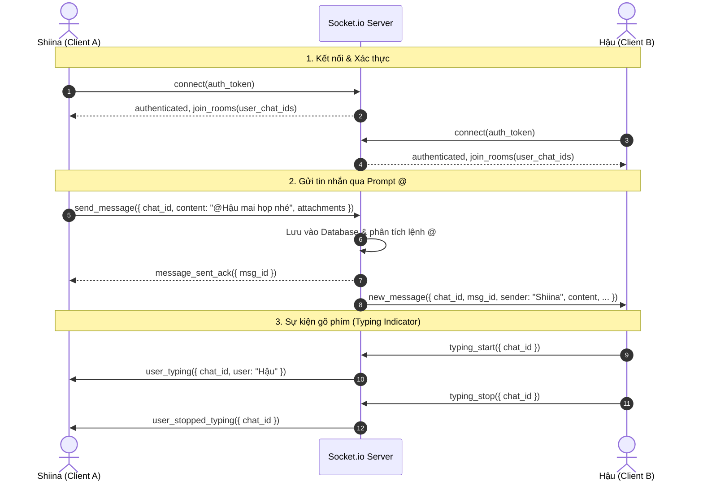

# 🏛️ PingPing — Kiến trúc hệ thống (System Architecture)

Tài liệu này mô tả chi tiết thiết kế hệ thống, mô hình dữ liệu và cơ chế giao tiếp thời gian thực cho ứng dụng nhắn tin **PingPing**.

---

## 1. Mô hình tổng thể (High-Level Architecture)

PingPing áp dụng kiến trúc **Client - Server** kết hợp **REST API** (cho xác thực, cấu hình, tải tệp) và **WebSocket / Socket.io** (cho truyền nhận tin nhắn thời gian thực):

```
┌─────────────────────────────────────────────────────────────┐
│                       CLIENT (Web)                          │
│  - Vanilla JS / Single Page App                             │
│  - Claude-inspired CSS Design System                        │
│  - WebSocket Client (Socket.io-client)                      │
└──────────────────────────────┬──────────────────────────────┘
                               │
            HTTP REST API      │     WebSocket (Bi-directional)
         (Auth, Upload, Sync)  │     (Realtime Messages, Typing, Events)
                               ▼
┌─────────────────────────────────────────────────────────────┐
│                    BACKEND SERVER                           │
│  - Runtime: Node.js (Express) HOẶC Python (FastAPI)        │
│  - Realtime Engine: Socket.io / WebSockets                  │
│  - Static & Media Handler (Multer / Local File Storage)     │
└──────────────────────────────┬──────────────────────────────┘
                               │
                               ▼
┌─────────────────────────────────────────────────────────────┐
│                   DATABASE & FILE STORAGE                   │
│  - Database: SQLite / PostgreSQL / MongoDB                  │
│  - Uploads Directory: /uploads/ (Images, Videos, Docs)       │
└─────────────────────────────────────────────────────────────┘
```

---

## 2. Mô hình dữ liệu (Database Schema)

Hệ thống sử dụng cấu trúc cơ sở dữ liệu quan hệ (Relational) hoặc tài liệu (Document) đơn giản, lưu trữ trực tiếp:

### 2.1. Bảng `users` (Người dùng)
| Trường | Kiểu dữ liệu | Mô tả |
| :--- | :--- | :--- |
| `id` | `VARCHAR(36)` / `INTEGER` | Khóa chính (UUID hoặc Auto Increment) |
| `username` | `VARCHAR(50)` | Tên đăng nhập (Unique) |
| `password` | `VARCHAR(255)` | Mật khẩu tài khoản (Lưu text/hash cơ bản) |
| `display_name` | `VARCHAR(100)` | Tên hiển thị (ví dụ: *Lương Thanh Hậu*) |
| `role` | `VARCHAR(100)` | Vai trò/Chức vụ (ví dụ: *Quản lý*, *Kỹ thuật viên*) |
| `avatar_url` | `VARCHAR(255)` | Đường dẫn ảnh đại diện (Tùy chọn) |
| `created_at` | `TIMESTAMP` | Thời điểm tạo tài khoản |

### 2.2. Bảng `chats` / `sessions` (Cuộc trò chuyện / Nhóm)
| Trường | Kiểu dữ liệu | Mô tả |
| :--- | :--- | :--- |
| `id` | `VARCHAR(36)` | Khóa chính của phòng chat / session |
| `title` | `VARCHAR(255)` | Tên cuộc trò chuyện / nhóm |
| `type` | `VARCHAR(20)` | Loại chat: `'direct'` (1-1) hoặc `'group'` (Nhóm) |
| `created_by` | `VARCHAR(36)` | ID người tạo session |
| `created_at` | `TIMESTAMP` | Thời gian tạo session |
| `updated_at` | `TIMESTAMP` | Thời gian có tin nhắn mới nhất |

### 2.3. Bảng `chat_members` (Thành viên tham gia chat)
| Trường | Kiểu dữ liệu | Mô tả |
| :--- | :--- | :--- |
| `id` | `VARCHAR(36)` | Khóa chính |
| `chat_id` | `VARCHAR(36)` | Khóa ngoại trỏ đến `chats.id` |
| `user_id` | `VARCHAR(36)` | Khóa ngoại trỏ đến `users.id` |
| `joined_at` | `TIMESTAMP` | Thời gian được thêm vào nhóm |

### 2.4. Bảng `messages` (Tin nhắn & Sự kiện)
| Trường | Kiểu dữ liệu | Mô tả |
| :--- | :--- | :--- |
| `id` | `VARCHAR(36)` | Khóa chính tin nhắn |
| `chat_id` | `VARCHAR(36)` | ID cuộc trò chuyện |
| `sender_id` | `VARCHAR(36)` | ID người gửi (Null nếu là tin hệ thống) |
| `content` | `TEXT` | Nội dung văn bản (hỗ trợ Markdown) |
| `msg_type` | `VARCHAR(20)` | `'text'`, `'system'`, `'image'`, `'video'`, `'file'`, `'voice'`, `'artifact'` |
| `media_url` | `TEXT` | URL ảnh, video, hoặc voice note |
| `file_name` | `VARCHAR(255)` | Tên tệp đính kèm |
| `file_size` | `VARCHAR(50)` | Dung lượng tệp (ví dụ: `2.4 MB`) |
| `created_at` | `TIMESTAMP` | Thời gian gửi tin |

---

## 3. Luồng hoạt động thời gian thực (Realtime Socket Flow)



---

## 4. Cơ chế xử lý lệnh `@` (Tag & Member Management)

Khi một tin nhắn được gửi lên máy chủ:
1. Máy chủ chạy biểu thức Regex quét các cú pháp `@<Tên>` và `@rm-<Tên>`.
2. **Nếu là phiên chat mới từ Hero New Chat**:
   - Nếu có 1 người được tag $\rightarrow$ Kiểm tra/tạo `chats` dạng `direct`.
   - Nếu có $\ge 2$ người được tag $\rightarrow$ Tạo `chats` dạng `group`, tự động thêm các user vào bảng `chat_members`.
## 5. Kênh công khai "World Class" & Cơ chế xoay vòng tin nhắn (Message Retention Strategy)

### 5.1. Kênh toàn cầu "World Class" (`chat-world-class`)
- Mặc định luôn tồn tại trong hệ thống với ID cố định `chat-world-class` và tên hiển thị **"World Class"** (🌍).
- Mọi tài khoản khi đăng ký thành công sẽ tự động được gán quyền tham gia kênh này (`auto_join = true`).
- Kênh dùng cho toàn bộ cộng đồng người dùng giao lưu, thảo luận mở.

### 5.2. Hạn mức lưu trữ tin nhắn (Message Retention Limits)
Để đảm bảo hệ thống luôn nhẹ, nhanh, tối ưu dung lượng và tránh phình to database:
- **Session thông thường (1-1 Direct hoặc Nhóm riêng)**: Giới hạn lưu trữ tối đa **36 tin nhắn** gần nhất.
- **Kênh toàn cầu "World Class"**: Giới hạn lưu trữ tối đa **180 tin nhắn** gần nhất.

### 5.3. Cơ chế ghi và xóa xoay vòng (Atomic FIFO Pruning & Concurrency Control)
Để tránh xung đột dữ liệu (Race condition / Database lock) khi nhiều người nhắn tin cùng lúc:

1. **Thực thi bằng Atomic Transaction**:
   Khi có tin nhắn mới được ghi vào `messages`, việc kiểm tra và xóa tin nhắn cũ được thực hiện trong cùng một Database Transaction:
   ```sql
   -- Bước 1: Ghi tin nhắn mới
   INSERT INTO messages (id, chat_id, sender_id, content, created_at)
   VALUES (?, ?, ?, ?, CURRENT_TIMESTAMP);

   -- Bước 2: Xóa xoay vòng an toàn (Atomic FIFO Pruning)
   -- Giữ lại đúng N tin nhắn mới nhất (36 hoặc 180), xóa các tin nhắn cũ hơn
   DELETE FROM messages 
   WHERE chat_id = ? 
     AND id NOT IN (
       SELECT id FROM messages 
       WHERE chat_id = ? 
       ORDER BY created_at DESC 
       LIMIT ? -- 36 đối với chat thường, 180 đối với World Class
     );
   ```

2. **Dọn dẹp tệp đính kèm vật lý (Media Clean-up)**:
   - Các bản ghi bị xóa nếu có đính kèm file/ảnh trong ổ đĩa cục bộ `./uploads/` sẽ được đưa vào hàng đợi dọn dẹp (Background File Garbage Collector) để giải phóng dung lượng đĩa.
3. **Phát sóng Realtime Event `message_deleted`**:
   - Khi có tin nhắn cũ bị dọn dẹp khỏi giới hạn, server chỉ gửi cập nhật nếu client cần đồng bộ lại giao diện. Client sẽ tự động giữ đúng 36/180 phần tử trong bộ nhớ RAM DOM.
